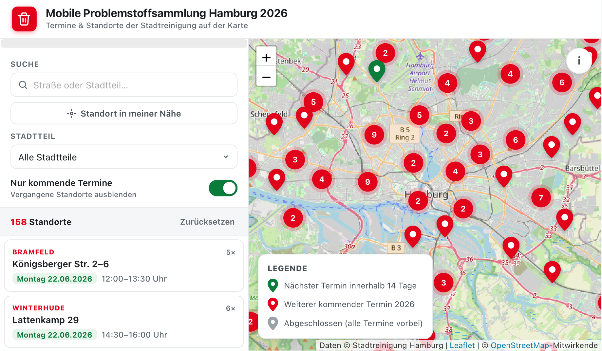

# Mobile Problemstoffsammlung Hamburg 2026 – Kartenansicht

Eine interaktive Karte der **mobilen Problemstoffsammlung** der Stadtreinigung
Hamburg für 2026. Die offiziellen Termine stehen nur in einem schwer lesbaren,
zweispaltigen PDF – diese Seite zeigt alle Standorte und Abholtermine auf einer
OpenStreetMap-Karte.

**➡️ Live: https://maxdaten.github.io/problemstoffsammlung-hamburg/**



## Funktionen

- Alle **158 Standorte** mit **795 Terminen** als gruppierte Marker auf der Karte.
- Popup je Standort mit vollständiger Adresse und allen Abholterminen
  (`Freitag, 13.02.2026 · 09:00–10:30 Uhr`); vergangene Termine ausgegraut,
  der nächste hervorgehoben.
- Seitenleiste mit Suche (Straße/Stadtteil), Stadtteil-Filter, „Nur kommende
  Termine“ und „Standort in meiner Nähe“ (Geolocation → nächster Standort).
- Liste sortiert nach nächstem Termin, synchron mit der Karte.

Die Seite ist eine einzelne, eigenständige `index.html` (Daten eingebettet,
keine Server- oder Build-Schritte nötig – auch per `file://` lauffähig).

## Datenherkunft

- **Termine:** © Stadtreinigung Hamburg –
  [Auszug_INFO_Mobile_Problemstoffsammlung_2026.pdf](https://files.stadtreinigung.hamburg/website/download/PDF/Auszug_INFO_Mobile_Problemstoffsammlung_2026.pdf)
- **Karte:** © OpenStreetMap-Mitwirkende ([ODbL](https://opendatacommons.org/licenses/odbl/))

> Hinweis: Dies ist eine inoffizielle Visualisierung und kein Angebot der
> Stadtreinigung Hamburg. Verbindlich sind ausschließlich die offiziellen Angaben.

## Daten neu erzeugen

Die Daten werden in zwei Schritten aus dem PDF gewonnen:

```sh
# 1) PDF -> schedule.json  (Geometrie-basiertes Parsing, braucht pdfplumber)
nix-shell -p "python3.withPackages(ps: [ps.pdfplumber])" --run "python3 parse.py"

# 2) Adressen geokodieren -> data.json  (OSM Nominatim, 1 Anfrage/Sek., gecacht)
python3 geocode.py
```

`data.json` ist anschließend in `index.html` eingebettet (minifiziertes JSON im
`<script id="schedule-data">`). Nach einer Datenaktualisierung den Inhalt von
`data.json` dort ersetzen.

### Wie das Parsing funktioniert

`pdftotext` scheitert an dem Layout: zwei Spalten werden verschränkt und die
Zeitfenster-Symbole (`■✚●▲★◆`) sitzen auf einer leicht versetzten Grundlinie.
`parse.py` arbeitet daher auf Wortebene mit Koordinaten: Spalten per x-Position
trennen, Zeilen über die vertikale Mitte clustern, und jedes Datum geometrisch
mit dem Symbol rechts daneben paaren. Wochentage werden aus dem ISO-Datum neu
berechnet (das PDF enthält vereinzelt falsch gedruckte Wochentage).

## Lizenz

Code: MIT. Daten unter den oben genannten Lizenzen der jeweiligen Quellen.
